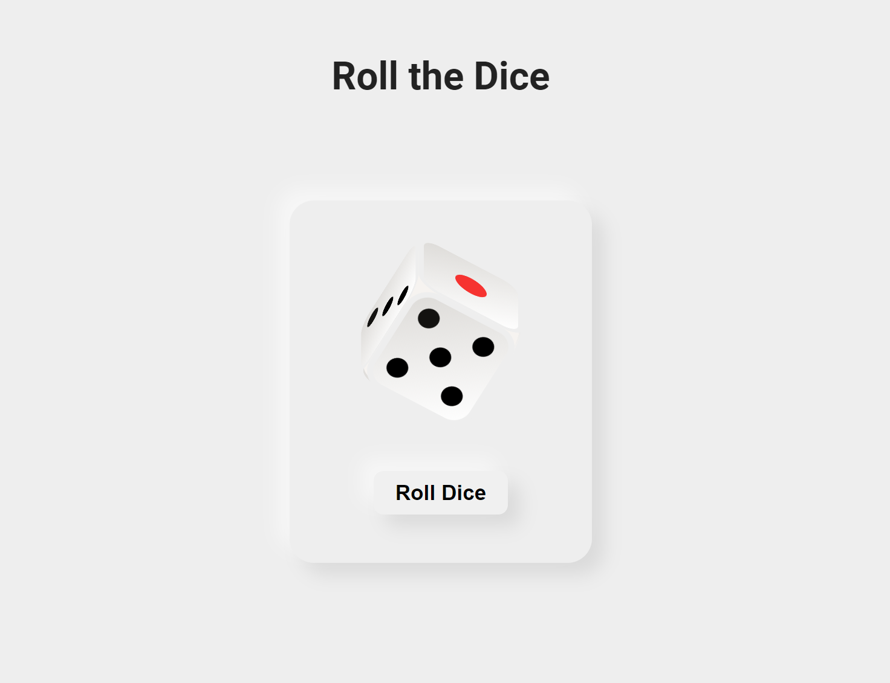

# Roll Dice Website

**🎲Roll Online: https://roll-dice-2to.pages.dev/**

A visually engaging dice rolling simulator built with HTML, CSS, and JavaScript.

Preview:

This project showcases the power of CSS transforms and animations to create dynamic and interactive user experiences. Users can click a button to roll the dice, and the dice will realistically animate as it tumbles to a random face.

## Features

- **Random dice rolls:** Each roll generates a random number between 1 and 6.
- **Realistic animations:** CSS transforms and transitions create smooth, natural-looking dice animations.
- **Visually appealing design:** The UI is styled in neumorphic design.

## Technologies Used:

- **HTML:** Structure of the dice and the roll button.
- **CSS:** Styling, layout, transforms, and animations for the dice.
- **JavaScript:** Event handling and logic to trigger the dice rolls.
